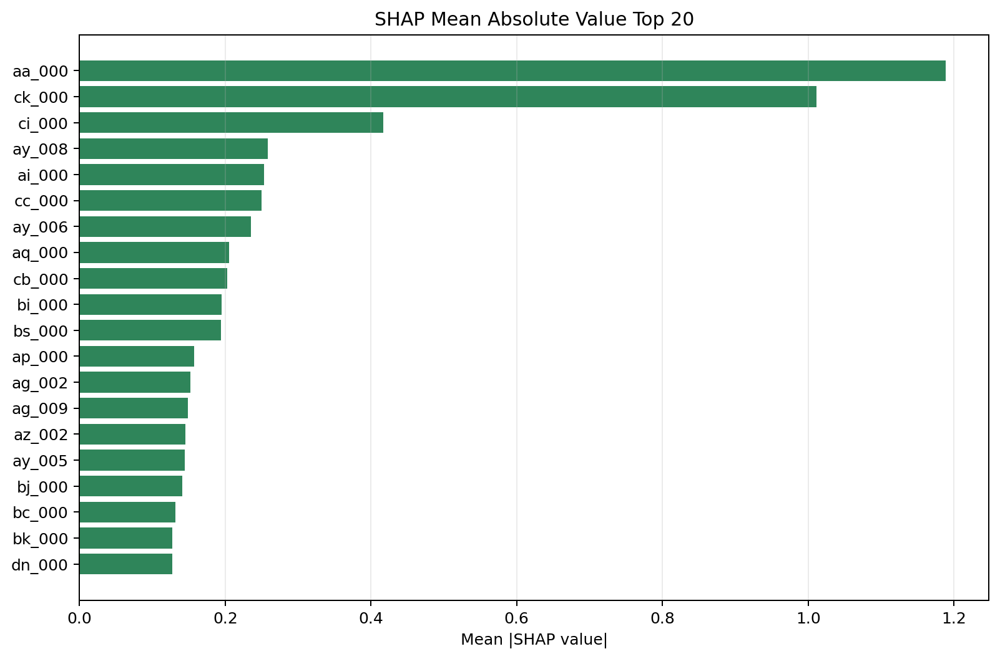
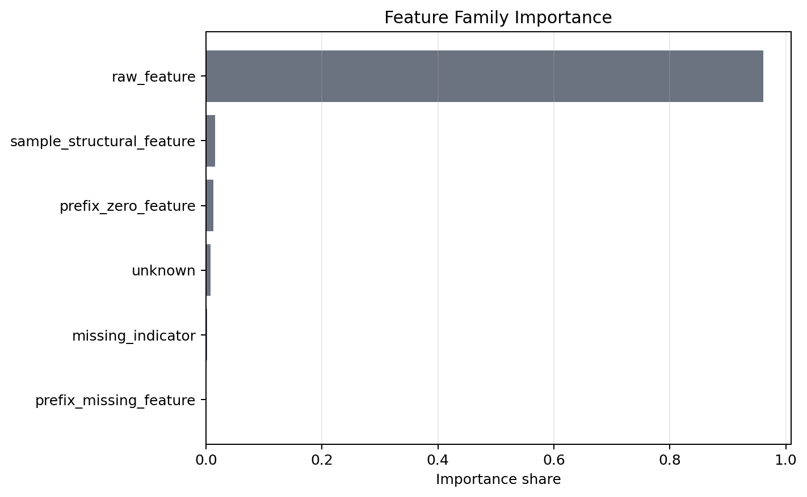

# Scania APS 预测性维护项目

## 1. 项目概览

本项目基于 Scania APS 故障数据集，构建一个面向工业预测性维护场景的成本敏感建模流程。任务目标是从高维匿名传感器特征和结构性缺失数据中识别 APS 相关故障。

项目围绕成本敏感预测性维护展开，覆盖维修优先级排序、SQL 业务分析和模型解释性三个交付方向。

## 2. 业务问题与成本设定

APS 故障漏检的业务代价远高于误检。FN 表示真实 APS 故障没有被模型识别，可能带来停机、故障扩大和更高维修成本；FP 主要带来额外检查工作量。

本项目使用数据集给定的业务成本：

```text
total_cost = 10 * FP + 500 * FN
```

| 错误类型 | 含义 | 成本 |
|---|---|---:|
| FP | 不必要的检查 | 10 |
| FN | 漏检故障 / 故障停机风险 | 500 |

由于数据类别极不平衡，准确率不适合作为核心指标。本项目重点关注 recall、F2、PR-AUC、FN 和 total_cost。

## 3. 最终结果

最终候选方案：

- 策略：`median_all_structural_all`
- 模型：带 `scale_pos_weight` 的 XGBoost
- 阈值：`0.18`
- 官方测试集结果：`TN=15227`，`FP=398`，`TP=363`，`FN=12`
- 总业务成本：`9980`

| 模型 / 策略 | 数据集 | 阈值 | TP | FP | TN | FN | 总成本 |
|---|---|---:|---:|---:|---:|---:|---:|
| naive_all_negative | official_test | - | 0 | 0 | 15625 | 375 | 187500 |
| day14_baseline_median_all | official_test | 0.16 | 362 | 432 | 15193 | 13 | 10820 |
| day14_structural_all_final_candidate | official_test | 0.18 | 363 | 398 | 15227 | 12 | 9980 |
| day16_tuned_best | official_test | 0.19 | 360 | 376 | 15249 | 15 | 11260 |

最终候选方案将官方测试集成本从全预测负类基线的 `187500` 降到 `9980`，下降 `177520`，下降率约 `94.68%`。Day18 OOF 集成结果作为训练集内部稳健性检查单独记录。


## 4. 关键实验与决策

项目从基础模型、缺失值处理、结构特征、调参、OOF 稳健性检查逐步推进，最终收敛到 Day14 的结构特征方案。

| Stage | Strategy / Experiment | Result | Decision |
|---|---|---|---|
| Baseline models | Logistic Regression / Random Forest / XGBoost | XGBoost 在成本和 PR-AUC 上更适合作为主线模型 | 保留 XGBoost |
| Missing-value strategies | `median_all`、drop high missing、missing indicator、XGBoost native missing | missing indicator 有预测信号，但 FP 偏高 | 保留为对照信号 |
| Structural features | sample-level missing/zero、prefix zero/missing、selected missing indicators、`structural_all` | `structural_all` 在官方测试集达到 cost `9980` | 最终候选 |
| XGBoost tuning | Day15 在 valid 上改善 | Day16 官方测试集 best tuned cost 为 `11260` | 未进入最终方案 |
| OOF / bin projection | OOF 用于检查单一 valid split 的阈值稳定性，bin projection 只有轻微信号 | 对最终主线贡献有限 | 作为稳健性检查 |
| OOF ensemble | 多策略概率平均 | OOF cost 略有改善，但 FN 增加 | 未进入官方测试集 |
| SQL business analysis | Top-K、risk level、lift、threshold sensitivity | 将模型概率转化为维修容量和优先级视图 | 作为业务交付 |

Day6 的 `8640` 用于展示阈值敏感性；最终报告结果采用 Day14 `median_all_structural_all`，阈值固定为 `0.18`。

## 5. 评估指标

官方测试集中负类样本远多于正类 APS 故障样本，准确率无法充分反映漏检故障的业务风险。项目使用以下指标连接模型表现和维修决策：

| Metric | Role in This Project |
|---|---|
| Recall | 衡量捕获了多少真实 APS 故障 |
| F2-score | 比 F1 更强调 recall，适合漏检成本更高的场景 |
| PR-AUC | 比 accuracy 更适合稀有正类场景下的概率排序评估 |
| Total Cost | 直接反映 FP / FN 的业务惩罚 |
| Precision@K | 衡量有限检修容量下高风险队列的命中质量 |
| Lift | 衡量真实故障是否集中在高风险分位 |

## 6. 方法流程

项目采用简洁的分析 pipeline：

1. 数据理解与缺失值诊断。
2. 基线建模。
3. 成本敏感阈值分析。
4. 基于验证集的模型选择。
5. 结构特征实验。
6. 固定验证阶段选出的策略和阈值，在官方测试集上做最终观察。
7. SQL 业务分析。
8. 模型解释性分析。

完整开发过程记录保存在 `reports/summary.md`，README 只展示最终项目主线。

## 7. 业务洞察

模型输出被进一步转化为维修计划视图，用于回答“有限维修资源应该优先检查哪些样本”。


Top-K 分析把概率排序转化为维修容量视图：前 500 个高风险匿名样本覆盖 340 / 375 个真实 APS 故障。


风险等级视图展示了维修工作量分布：Critical 层级真实正类率为 78.22%，适合作为最高优先级检查队列。


Decile / lift 分析显示最高风险分位显著富集真实故障，最高风险 decile 的 lift 为 `9.95`。

更完整的 SQL 业务结论见 `reports/sql_business_insights.md`。

## 8. 阈值敏感性


敏感性分析展示了漏检故障和检查工作量之间的权衡。最终报告阈值保持为 Day14 验证阶段确定的 `0.18`。

阈值敏感性表显示，更低的诊断阈值，例如 `0.07`，可以把 FN 从 `12` 降到 `6`，同时会把预测正类工作量从 `761` 个样本增加到 `1016` 个样本。

## 9. 模型解释性



SHAP 风格贡献图展示了模型评分中影响最大的匿名字段，主要贡献来自原始数值特征。



特征家族汇总显示，结构特征提供补充信号，但模型主体仍由原始匿名数值字段驱动。

解释性结论：

- XGBoost 增益和 SHAP 风格贡献显示，模型主要依赖匿名原始数值字段。
- 在 XGBoost 增益前列特征中，`prefix_cn_zero_rate` 和 `missing_br_000` 说明结构性缺失 / 零值信号被模型利用，但不是主导信息源。
- 按特征家族汇总，`raw_feature` 贡献约 `92.92%` 的 XGBoost 增益，以及约 `96.07%` 的平均绝对 SHAP 贡献。
- 特征重要性和 SHAP 解释的是模型评分贡献，不提供匿名字段的真实传感器或物理部件含义。

详细解释性分析见 `reports/model_interpretability.md`。

## 10. SQL 分析

Day19 将最终候选方案的预测结果和策略对比表导出为可用于 SQL 分析的 CSV。MySQL 导入是可选步骤，README 只展示核心分析价值。

核心 SQL 文件：

- `sql/08_topk_maintenance_capacity_analysis.sql`
- `sql/09_risk_workload_analysis.sql`
- `sql/10_prediction_error_analysis.sql`
- `sql/11_business_cost_policy_comparison.sql`
- `sql/12_model_monitoring_template.sql`
- `sql/13_decile_lift_gain_analysis.sql`
- `sql/14_threshold_sensitivity_analysis.sql`

这些 SQL 覆盖维修容量、风险等级工作量、预测错误分析、成本策略对比、监控模板、decile lift/gain 和阈值敏感性。MySQL Workbench 导入说明见 `docs/mysql_import_guide.md`。

## 11. 如何复现

安装依赖：

```powershell
pip install -r requirements.txt
```

将 Scania APS 原始 CSV 放入：

```text
data/raw/
```

原始文件名由 `config/config.yaml` 配置：

```text
data/raw/aps_failure_training_set.csv
data/raw/aps_failure_test_set.csv
```

运行最终候选方案的官方测试集评估：

```powershell
python scripts/12_structural_feature_test_evaluation.py
```

生成 SQL 业务分析导出：

```powershell
python scripts/17_prepare_sql_business_tables.py
```

生成最终业务图表和洞察表：

```powershell
python scripts/18_generate_business_insight_figures.py
```

生成模型解释性表格和图表：

```powershell
python scripts/19_model_interpretability.py
```

说明：

- 原始数据文件不提交到 Git。
- 模型产物不提交，最终模型由脚本复现。
- MySQL 导入是可选步骤，单独记录在文档中。
- 复现主入口是 `scripts/`；notebook 主要用于分析展示，`notebooks/archive/` 中的历史 notebook 可能依赖本地再生成的过程型 outputs。

## 12. 项目结构

```text
config/                         项目配置和结构特征配置
src/scania_aps/                 可复用 Python 模块
scripts/                        可执行分析和报告生成流程
sql/                            维修决策分析 SQL
notebooks/final/                最终分析主线 notebook，适合浏览
notebooks/archive/              历史实验 notebook，用于审计和复盘
reports/                        项目报告、业务洞察、解释性分析
outputs/figures/final/          README / report 使用的最终图表
outputs/tables/final/           最终汇总表
outputs/sql_exports/            SQL 分析用 CSV
docs/                           数据字典、导入说明、项目结构说明
tests/                          轻量级 schema 和工具函数测试
```

更详细的目录说明见 `docs/project_structure.md`。

## 13. 项目适用范围

- 数据集是公开且较早的数据，更适合作为离线建模和业务分析案例。
- 特征已经匿名化，模型解释只能停留在评分贡献层面。
- 数据中没有真实车辆 ID 或维修历史记录；`sample_id` 只表示匿名样本编号。
- 阈值选择依赖业务策略和维修工作量容忍度，实际落地需要结合现场运维资源重新校准。
