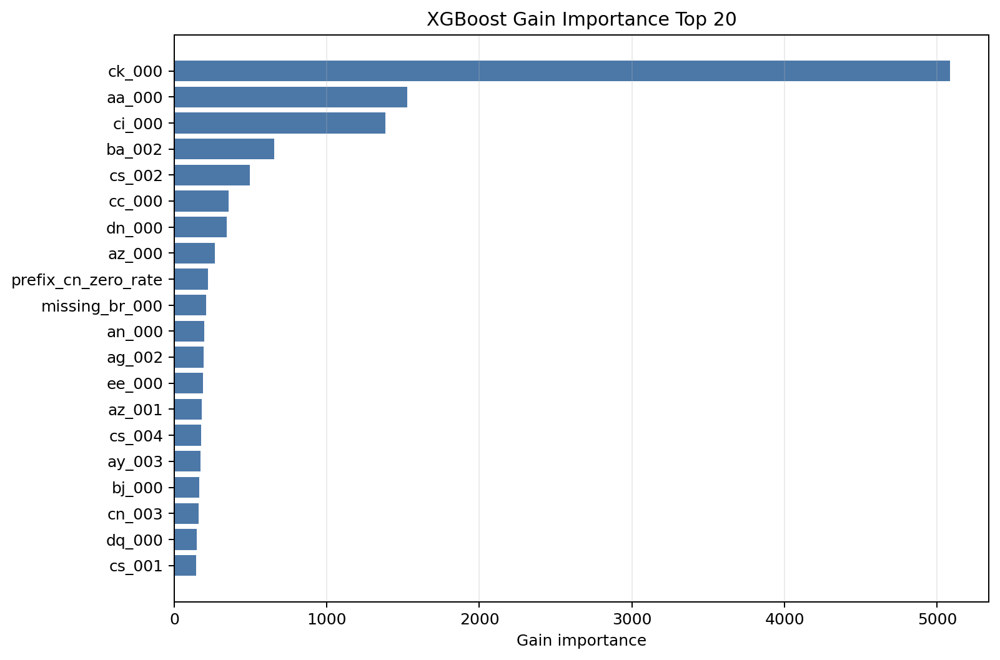
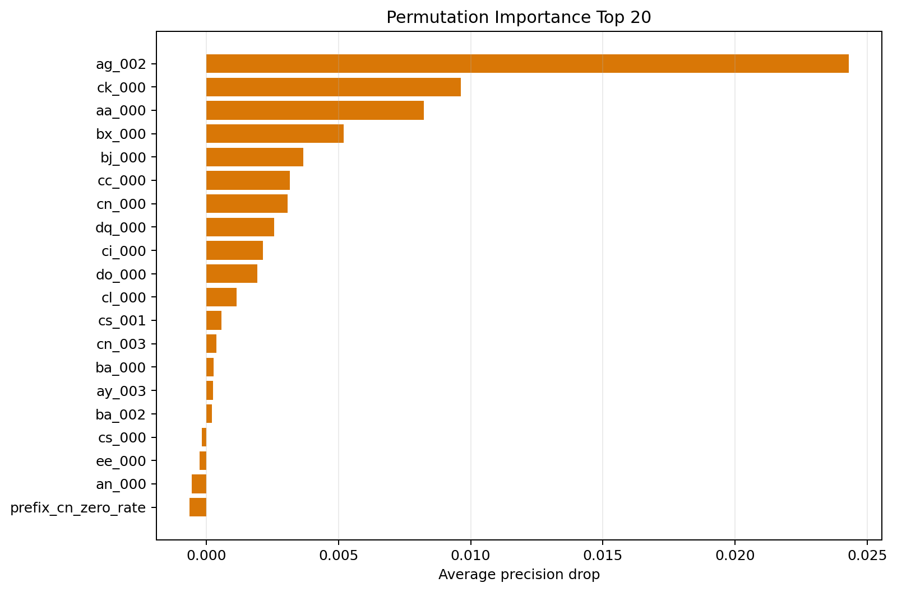
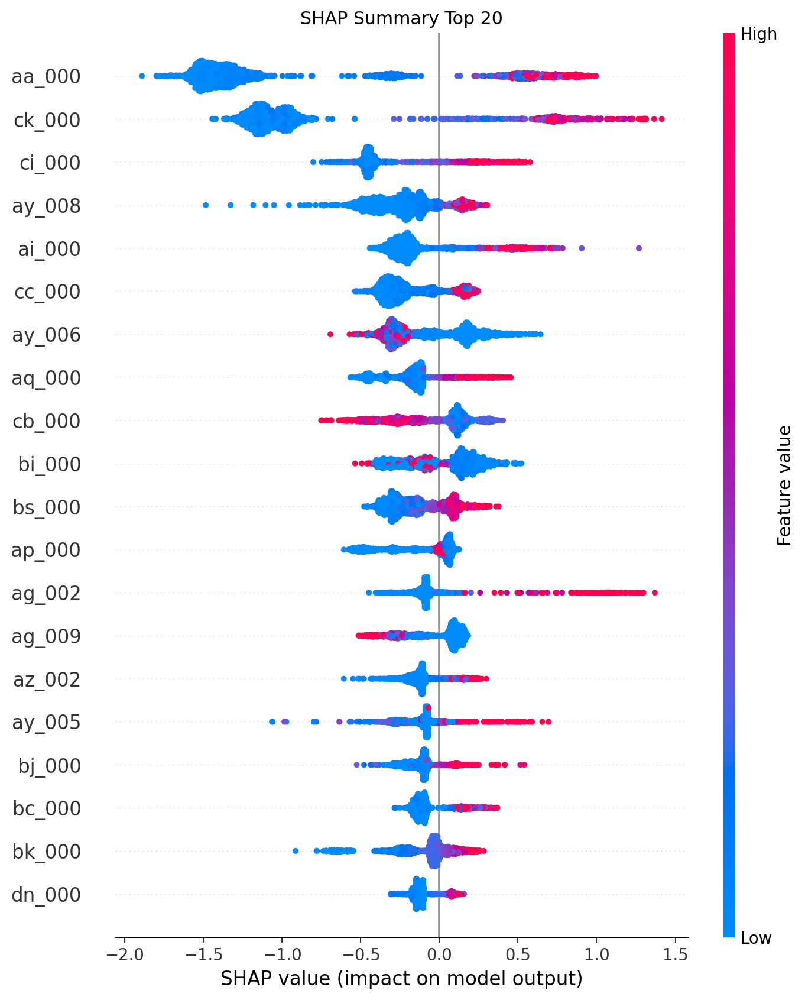

# Scania APS 预测性维护项目报告

## 1. 项目背景

本项目使用 Scania APS 重卡空气压力系统故障数据集，模拟制造业和车队运维中的预测性维护问题。业务目标不是简单判断样本属于 `pos` 或 `neg`，而是将模型结果转化为维修优先级和风险分层建议，帮助有限维修资源优先处理高风险车辆。

在该业务中，误报会带来不必要检查，漏报则可能导致车辆 breakdown、停机和更高维修成本。因此项目采用成本敏感评估：FP 成本为 10，FN 成本为 500。代码中成本参数统一从 `config/config.yaml` 读取。

## 2. 数据问题

Scania APS 数据集具有典型工业数据特征：

- 训练集 60,000 行，测试集 16,000 行。
- 除标签列外包含 170 个匿名数值特征。
- 原始数据中 `"na"` 表示缺失值。
- 正类 `pos` 极少，训练集正类占比约 1.67%，测试集正类占比约 2.34%。
- 特征匿名，无法解释具体传感器物理含义。
- 缺失值具有结构性，pos/neg 缺失模式存在明显差异。

这些问题决定了项目不能以 accuracy 作为核心指标，而应关注 recall、F2、PR-AUC 和 total cost。

## 3. 方法流程

项目按阶段推进：

1. Day 1：业务理解和项目初始化。
2. Day 2：数据质量、缺失值和标签分布分析。
3. Day 3：SQL 数据质量分析支持。
4. Day 4：Dummy / Logistic baseline。
5. Day 5：Random Forest / XGBoost 提升模型对比。
6. Day 6：阈值成本敏感性分析。
7. Day 7：风险分层、维修优先级建议和交付文档整理。
8. Enhancement：validation-based model selection。

## 4. 缺失值处理策略

项目初始阶段没有直接删除高缺失字段，而是保留可验证空间。Day 4 / Day 5 主要比较：

- `median_all`：保留全部特征，使用训练集 median 填充。
- `drop_high_missing_median`：仅基于训练集识别缺失率大于等于 80% 的字段，删除后再做 median 填充。
- `median_with_indicator`：加入缺失指示变量，主要用于部分模型对比。

缺失值处理规则只在训练侧拟合，再应用到验证集或测试集，避免数据泄漏。

## 5. 模型对比

默认阈值 0.5 下，Day 4 / Day 5 的主要结果包括：

- Dummy baseline 漏报全部 375 个测试集正类，total cost = 187,500。
- Logistic + `drop_high_missing_median`：recall = 0.9280，FN = 27，total cost = 17,180。
- XGBoost + `median_all`：PR-AUC 更高，说明概率排序能力更好，但默认阈值下 total cost = 18,460，不一定成本最低。

这说明模型概率排序能力和最终业务成本之间需要通过阈值选择连接起来。

## 6. 阈值成本分析

Day 6 不重新训练模型，只读取已有预测概率，对阈值 0.01 到 0.99 做测试集回溯敏感性分析。

最低成本组合为：

| 方案 | 阈值 | Precision | Recall | F2 | FP | FN | Total Cost |
|---|---:|---:|---:|---:|---:|---:|---:|
| XGBoost + median_all | 0.20 | 0.4692 | 0.9760 | 0.8026 | 414 | 9 | 8640 |

与默认阈值 0.5 相比，阈值 0.20 的 FP 从 196 增加到 414，但 FN 从 33 降到 9。由于 FN 成本远高于 FP，total cost 从 18,460 降到 8,640。

需要强调：Day 6 结果属于测试集回溯敏感性分析，不是生产环境最终阈值。

## 7. 风险分层

基于 XGBoost + `median_all` 的预测概率和阈值 0.20，Day 7 输出四级风险分层：

| Risk Level | 车辆数 | 实际 APS 故障数 | TP | FP | FN | TN | 建议动作 |
|---|---:|---:|---:|---:|---:|---:|---|
| Critical | 411 | 324 | 324 | 87 | 0 | 0 | 立即检修 |
| High | 369 | 42 | 42 | 327 | 0 | 0 | 优先检修 |
| Medium | 415 | 6 | 0 | 0 | 6 | 409 | 观察复查 |
| Low | 14805 | 3 | 0 | 0 | 3 | 14802 | 暂不处理 |

风险分层将概率输出转化为维修队列，使维修团队可以优先处理 Critical 和 High 样本。

## 8. 严谨性增强：Validation-based selection

Day 6 / Day 7 的阈值来自官方 test 上的回溯敏感性分析。为了降低测试集回溯选择阈值带来的乐观偏差，本轮增强从官方 training set 中划分出 `train_inner` 和 `valid`：

| dataset | row_count | pos_count | neg_count | pos_rate |
|---|---:|---:|---:|---:|
| official_train | 60000 | 1000 | 59000 | 0.0167 |
| train_inner | 48000 | 800 | 47200 | 0.0167 |
| valid | 12000 | 200 | 11800 | 0.0167 |

流程为：在 `train_inner` 上训练 Logistic Regression 和 XGBoost，在 `valid` 上选择模型、缺失处理策略和阈值，最后在 official test 上只做一次最终评估。

valid 上的最佳组合为：

```text
XGBoost + drop_high_missing_median + threshold 0.14
```

official test 最终评估结果为：

| 选择方式 | 模型 | 缺失策略 | 阈值 | Precision | Recall | F2 | FP | FN | Total Cost |
|---|---|---|---:|---:|---:|---:|---:|---:|---:|
| valid 选择后 test 评估 | XGBoost | drop_high_missing_median | 0.14 | 0.4370 | 0.9707 | 0.7801 | 469 | 11 | 10190 |
| Day 6 test 回溯最优 | XGBoost | median_all | 0.20 | 0.4692 | 0.9760 | 0.8026 | 414 | 9 | 8640 |

相比 Day 6 test 回溯最优，valid-based 流程在 official test 上 total cost 高出 1,550，FP 增加 55，FN 增加 2。这说明 Day 6 结果存在一定测试集回溯乐观偏差；同时，valid 选择出的 XGBoost 方案仍然保持较高 recall 和较低业务成本，整体方向是稳定的。

## 9. 缺失值与特征工程消融实验

在 validation-based 流程基础上，本轮进一步比较缺失值处理和基础特征工程策略。实验仍然只在 `valid` 上选择策略和阈值，official test 只用于最终评估，避免用测试集反向选择方案。

本轮覆盖的主要策略包括：

- `median_all`：保留全部字段并做 median 填充。
- `drop_80_missing_median`：删除 train_inner 中缺失率大于等于 80% 的字段。
- `drop_50_missing_median`：删除 train_inner 中缺失率大于等于 50% 的字段。
- `median_with_indicator`：median 填充并加入缺失指示变量。
- `xgb_native_missing`：仅用于 XGBoost，保留 NaN，由模型原生处理缺失。
- `missing_indicator_only`：只使用每个字段是否缺失的 0/1 指示变量。
- `low_variance_filter`、`high_correlation_filter`、`l1_feature_selection`：基础特征筛选对照实验。

关键结果如下：

| 策略 | 模型 | valid best threshold | official test total cost | Recall | F2 | FP | FN | 结论 |
|---|---|---:|---:|---:|---:|---:|---:|---|
| drop_50_missing_median | XGBoost | 0.14 | 10820 | 0.9680 | 0.7740 | 482 | 12 | valid 成本最低，但 test 不如 drop_80 稳定 |
| drop_80_missing_median | XGBoost | 0.14 | 10190 | 0.9707 | 0.7801 | 469 | 11 | 删除极高缺失字段较稳，是 validation 基准方案 |
| median_all | XGBoost | 0.16 | 10820 | 0.9653 | 0.7890 | 432 | 13 | 保留全部字段表现稳定，但成本不最低 |
| median_with_indicator | XGBoost | 0.10 | 10060 | 0.9760 | 0.7556 | 556 | 9 | test 观察成本最低，说明缺失指示有信息 |
| xgb_native_missing | XGBoost | 0.18 | 11180 | 0.9600 | 0.8079 | 368 | 15 | F2 和 precision 较好，但 FN 增加导致成本不占优 |
| missing_indicator_only | XGBoost | 0.78 | 27570 | 0.8987 | 0.6255 | 857 | 38 | 缺失模式有信号，但不能单独替代原始数值 |
| high_correlation_filter | XGBoost | 0.13 | 12410 | 0.9600 | 0.7656 | 491 | 15 | 当前不建议作为主线 |
| l1_feature_selection | Logistic | 0.35 | 16780 | 0.9360 | 0.7535 | 478 | 24 | 可作线性模型解释辅助，但不是最优 |

本轮最重要的结论不是“某个复杂策略一定更好”，而是：

1. `missing_indicator_only` 的 AP 明显高于正类基准率，说明缺失模式本身确实携带预测信号。
2. `median_with_indicator` 在 official test 观察中成本最低，但由于 test 不参与策略选择，只能把它视为值得后续验证的方向，而不是最终方案。
3. `drop_50_missing_median` 在 valid 上 total cost 最低，但 official test 上不如 `drop_80_missing_median` 稳定，说明高缺失字段不能只凭缺失率机械删除。
4. `xgb_native_missing` 没有在 total cost 上胜出，但 F2 较高，可以在后续轻量调参中继续保留观察。
5. 高相关过滤和 L1 特征选择有助于理解特征冗余或线性模型行为，但当前不适合作为主线方案。

## 10. 字段级分布诊断

Day 10 不做建模和调参，而是对 170 个匿名数值字段进行分布诊断，目的是为后续结构特征设计提供依据。本轮输出了字段级分布统计、缺失/零值统计、pos/neg 分布差异、train/valid/test 漂移统计和 Top 诊断清单。

核心观察如下：

- 高缺失字段集中在 `br_000`、`bq_000`、`bp_000`、`bo_000`、`ab_000`、`cr_000`、`bn_000`、`bm_000`。其中 train_inner 中缺失率大于等于 50% 的字段有 8 个，大于等于 80% 的字段有 2 个。
- 高零值字段非常明显。train_inner 中零值率大于等于 90% 的字段有 29 个，大于等于 50% 的字段有 53 个；Top 字段包括 `as_000`、`au_000`、`ag_000`、`ay_009`、`ay_000`、`ag_001`。
- 多个字段偏态和长尾极端，例如 `cs_009`、`cf_000`、`co_000`、`ad_000`、`dh_000`。这解释了为什么均值类处理不稳，也支持继续使用中位数填充、树模型或稳健缩放。
- pos/neg 缺失率差异最大的字段仍然集中在高缺失字段，例如 `br_000`、`bq_000`、`bp_000`、`bo_000`、`bn_000`。这与前面“缺失模式存在预测信号”的结论一致。
- pos/neg 数值分布差异明显的字段包括 `ah_000`、`bg_000`、`ci_000`、`bu_000`、`cq_000`、`bv_000`、`bb_000`、`an_000`。这些只能被解释为匿名字段上的统计差异，不能虚构具体传感器物理含义。
- train/test 缺失率差异整体较小，最大缺失率差异约为 0.5 个百分点；但 `eb_000`、`du_000`、`bu_000`、`bv_000`、`cq_000` 等字段的 p99 差异较大，说明长尾字段存在一定泛化风险。

这些观察支持后续做结构特征设计，例如样本级缺失计数、零值计数、前缀组统计、长尾截断或稳健变换对照。不过这些特征设计必须继续遵守 validation-based 流程：结构特征和阈值在 valid 上选择，official test 只用于最终评估。

## 11. 前缀组结构信号分析

Day 11 在 Day 10 字段级诊断基础上，进一步按字段名前缀进行匿名结构分组分析。前缀只作为统计结构线索，不代表任何具体传感器或部件含义。

本轮共识别出 107 个字段前缀组，其中 100 个是单字段前缀，真正包含多个字段、适合做“前缀组聚合”的只有 7 组：

| prefix | feature_count | avg_missing_rate | avg_zero_rate | avg_abs_pos_neg_zero_diff | avg_abs_skew |
|---|---:|---:|---:|---:|---:|
| ag | 10 | 0.0110 | 0.5117 | 0.2266 | 47.6380 |
| ay | 10 | 0.0109 | 0.6809 | 0.0861 | 53.4566 |
| cn | 10 | 0.0112 | 0.3277 | 0.2049 | 30.6079 |
| az | 10 | 0.0109 | 0.2881 | 0.0861 | 59.0042 |
| cs | 10 | 0.0109 | 0.1395 | 0.0559 | 60.8494 |
| ba | 10 | 0.0113 | 0.1358 | 0.0953 | 18.7601 |
| ee | 10 | 0.0109 | 0.1186 | 0.0482 | 15.5997 |

平均缺失率最高的前缀组主要是单字段前缀，例如 `br`、`bq`、`bp`、`bo`、`cr`、`ab`、`bn`、`bm`。这些字段缺失信号强，但不适合作为前缀组聚合主线，更适合在单字段缺失指示或稳健处理时观察。

平均零值率最高的前缀组同样多为单字段前缀，例如 `as`、`au`、`ef`、`dz`、`eg`。多字段组中，`ay` 的平均零值率最高，`ag` 次之，说明它们适合进入 Day 12 的组内 zero-count / zero-rate 候选。

pos/neg 缺失率差异最高的前缀组仍然集中在单字段高缺失字段，例如 `br`、`bq`、`bp`、`bo`、`bn`。pos/neg 零值差异较高的单字段前缀包括 `ai`、`al`、`am`、`ar`、`df`。多字段组中，`ag` 和 `cn` 的平均 pos/neg 零值差异相对更明显。

train/test drift 风险较高的前缀包括 `cl`、`du`、`ec`、`dq`、`ed` 等，多数也是单字段前缀；多字段组整体 drift 风险处于中等水平。后续如果使用 `ay`、`ag`、`cn`、`az`、`cs` 等组聚合特征，仍需在 validation 流程中验证，official test 只做最终评估。

Day 12 建议优先观察：

1. `ag`：零值率较高，pos/neg 零值差异相对明显。
2. `ay`：平均零值率最高，偏态明显。
3. `cn`：零值率和 pos/neg 零值差异较明显。
4. `az`、`cs`：偏态较高，可作为长尾结构候选。
5. `ba`、`ee`：组内信号较弱，作为低优先级备选。

## 12. 结构特征方案设计

Day 12 不训练模型，也不生成 processed 特征矩阵，而是把 Day 10 / Day 11 的结构信号整理为可执行的结构特征方案。设计结果写入 `docs/structural_feature_design.md`、`config/structural_features.yaml` 和 `outputs/tables/day12_structural_feature_design_table.csv`。

本轮设计了六类结构特征家族：

1. 样本级缺失统计：`sample_missing_count`、`sample_missing_rate`、`sample_non_missing_count`。
2. 样本级零值统计：`sample_zero_count`、`sample_zero_rate`、`sample_non_zero_count`。
3. 前缀组缺失聚合：对 `ag`、`ay`、`cn`、`az`、`cs`、`ba`、`ee` 生成 prefix missing count/rate。
4. 前缀组零值聚合：重点对 `ag`、`ay`、`cn`、`az`、`cs` 生成 prefix zero count/rate。
5. 筛选后的 missing indicators：只基于 train_inner 的缺失率和 pos/neg 缺失率差异筛选候选字段。
6. 可选异常/长尾统计：例如 p99 outlier count/rate，暂不进入 Day 13 第一轮。

结构特征设计表共 64 行，其中 60 行进入 Day 13 第一轮，4 行异常/长尾统计作为第二轮备选。设计表中 selected missing indicators 候选数为 30，Top 字段包括 `br_000`、`bq_000`、`bp_000`、`bo_000`、`bn_000`、`bm_000`、`di_000`、`dh_000`、`dj_000`、`dk_000`。

Day 13 第一轮建议实验矩阵为：

- `median_all`
- `median_all_sample_missing`
- `median_all_sample_zero`
- `median_all_prefix_missing`
- `median_all_prefix_zero`
- `median_all_selected_missing_indicators`
- `median_all_structural_all`

暂不做 PCA、SVM、大规模 GridSearch、SHAP，也不使用 official test 反向筛选结构特征。所有字段列表、prefix membership、indicator 候选和异常阈值都必须只在 train_inner 上 fit，valid 用于选择方案和阈值，official test 只用于最终评估。

## 13. 业务建议

如果强调 Day 7 业务交付，可以继续展示 XGBoost + `median_all` + threshold 0.20 的风险分层结果，但必须说明其阈值来自测试集回溯分析。

如果强调方法严谨性，应优先引用 validation-based 流程下的候选方案：

```text
XGBoost + drop_high_missing_median + threshold 0.14
```

该方案在 official test 上 FN = 11、total cost = 10,190，虽然不如 test 回溯最优低，但更接近真实模型选择流程。

## 14. 项目局限

1. 数据集较老，不代表最新车辆系统。
2. 特征匿名，无法解释具体传感器物理含义。
3. 数据没有时间戳，无法构建真实时序预测。
4. Day 7 风险分层阈值来自测试集回溯敏感性分析，不是生产最终阈值。
5. validation-based 流程仍然是单次划分，尚未做时间切分或交叉验证。
6. 缺少真实车辆 ID、维修记录和生产环境验证。

## 15. 后续改进方向

- 引入时间窗口和车辆 ID，构建真实提前预警任务。
- 与维修容量结合，设计 Top-K 检修策略。
- 基于 Day 12 设计表实现结构特征实验，并坚持 train_inner/valid/test 的严格边界。
- 做轻量级调参，但阈值和参数选择必须基于 validation，而不是 official test。
- 补充模型解释，例如特征重要性和 SHAP，但不虚构匿名特征物理含义。

## 16. 结构特征 valid 实验

在 Day 12 完成结构特征方案设计后，项目进入 Day 13 第一轮结构特征实验。本轮不使用 official test，而是在 official training set 内部划分出的 `train_inner / valid` 上完成结构特征方案和阈值选择。

本轮实验收窄为 XGBoost + median_all 基线，并按结构信号来源分组验证：样本级缺失率、筛选后的 missing indicators、前缀组零值率、核心结构组合以及全部结构特征上限方案。实验结果显示，`median_all_structural_all` 在 valid 上成本最低，但由于特征数量最多，只能视为上限观察；`median_all_selected_missing_indicators_top30` 更窄、更适合进入 Day 14 做 official test 最终观察。

| 实验组 | valid best threshold | valid total cost | Recall | F2 | FP | FN | 解释 |
|---|---:|---:|---:|---:|---:|---:|---|
| baseline_median_all | 0.16 | 6460 | 0.9700 | 0.7239 | 346 | 6 | 不加结构特征 |
| median_all_sample_missing_rate | 0.15 | 6250 | 0.9750 | 0.7117 | 375 | 5 | 样本整体缺失程度有一定信号 |
| median_all_selected_missing_indicators_top30 | 0.30 | 6050 | 0.9650 | 0.7732 | 255 | 7 | 更窄的 missing indicator 候选方案 |
| median_all_prefix_zero_rate | 0.09 | 6240 | 0.9850 | 0.6696 | 474 | 3 | 前缀组零值率可减少 FN，但 FP 较高 |
| median_all_structural_core | 0.16 | 6540 | 0.9700 | 0.7196 | 354 | 6 | 核心结构组合暂未优于 baseline |
| median_all_structural_all | 0.18 | 5850 | 0.9750 | 0.7331 | 335 | 5 | 上限观察，需警惕冗余和过拟合 |

这些结果只代表 valid 阶段的候选结论。Day 14 应选择 `median_all_structural_all` 和 `median_all_selected_missing_indicators_top30` 进入 official test 最终观察，不能把 valid 最优方案直接写成最终方案。

## 17. 结构特征 official test 观察

Day 14 对 Day 13 valid 阶段固定下来的少数候选方案做 official test 最终观察。候选方案和阈值都来自 Day 13 valid 结果，official test 不参与策略选择、结构特征规则拟合或阈值选择。

| 候选方案 | valid threshold | Precision | Recall | F2 | AP | FP | FN | Total Cost |
|---|---:|---:|---:|---:|---:|---:|---:|---:|
| baseline_median_all | 0.16 | 0.4559 | 0.9653 | 0.7890 | 0.9086 | 432 | 13 | 10820 |
| median_all_selected_missing_indicators_top30 | 0.30 | 0.5457 | 0.9387 | 0.8205 | 0.9085 | 293 | 23 | 14430 |
| median_all_prefix_zero_rate | 0.09 | 0.3846 | 0.9733 | 0.7452 | 0.9093 | 584 | 10 | 10840 |
| median_all_structural_all | 0.18 | 0.4770 | 0.9680 | 0.8027 | 0.9055 | 398 | 12 | 9980 |

结构特征的泛化表现并不完全等同于 valid 排名：

- `median_all_structural_all` 在 test 上 total cost 最低，但包含 60 个结构特征，仍然是上限观察方案，后续需要拆解贡献来源，不能直接作为最终主方案。
- `median_all_prefix_zero_rate` 保持较高 recall，并把 FN 降到 10，但 FP 明显增加，导致 total cost 与 baseline 接近。
- `median_all_selected_missing_indicators_top30` 在 valid 上较好，但 official test 上 FN 增加到 23，total cost 高于 baseline，说明 Top 30 missing indicators 泛化不足。

因此，结构特征方向不是无效，而是需要进一步做更细的结构特征筛选：例如缩小 selected missing indicators 数量，拆解 `structural_all` 的组成，保留更稳定的样本级和前缀组统计，再进入轻量调参或解释性分析。


## 18. Controlled XGBoost Tuning

在 Day14 完成结构特征候选方案的 official test 观察后，项目进入 Day15 受控 XGBoost 调参阶段。本轮没有继续扩大结构特征组合，而是固定少数候选方案，观察 XGBoost 参数空间是否还能在 validation 流程下进一步降低业务成本。

本轮不是全组合 GridSearch，而是 two-stage randomized search：

1. broad 阶段覆盖较大的参数空间；
2. refined 阶段只基于 broad 阶段在 valid 上表现较好的 Top trials 构造局部搜索空间；
3. 每个 trial 都在 valid 上遍历阈值，并按 total cost、FN、recall、F2、PR-AUC 排序；
4. official test 不参与 Day15 的参数选择、阈值选择或 refined search space 构造。

配置文件保留完整计划规模：每个候选策略 broad 100 trials、refined 50 trials。考虑本地交互运行耗时，本次实际运行使用环境变量覆盖为 broad 20、refined 8，共 84 个 trial；后续如需更充分复盘，可离线跑满配置规模。

本轮候选策略为：

| candidate_strategy | 作用 |
|---|---|
| baseline_median_all | 判断调参本身相对结构特征是否更重要 |
| median_all_structural_all | 当前结构特征上限观察方案 |
| drop_high_missing_median | 较稳的轻量高缺失字段处理方案 |

valid 最优结果：

| candidate_strategy | stage | threshold | Precision | Recall | F2 | AP | FP | FN | Total Cost |
|---|---|---:|---:|---:|---:|---:|---:|---:|---:|
| median_all_structural_all | broad | 0.31 | 0.4422 | 0.9750 | 0.7857 | 0.8745 | 246 | 5 | 4960 |
| drop_high_missing_median | broad | 0.19 | 0.3874 | 0.9800 | 0.7504 | 0.8649 | 310 | 4 | 5100 |
| baseline_median_all | refined | 0.13 | 0.4080 | 0.9750 | 0.7629 | 0.8887 | 283 | 5 | 5330 |

refined 阶段的收益并不稳定。只有 `baseline_median_all` 在 refined 阶段比 broad 阶段小幅降低 40 成本；`median_all_structural_all` 和 `drop_high_missing_median` 的最优 trial 均来自 broad 阶段。这说明在当前特征方案和 valid 划分下，XGBoost 参数调优能带来一定收益，但继续扩大随机搜索不一定比后续的解释性分析、SQL 业务深化和结构特征筛选更有价值。

Day16 只能选择 Day15 valid 上最优的少数 tuned 方案进入 official test 观察。建议优先观察 `median_all_structural_all`，同时保留 `drop_high_missing_median` 作为更轻量的候选对照；不能把 Day15 valid 最优写成最终模型。

## 19. Tuned XGBoost Official Test Evaluation

Day15 的 Controlled XGBoost Tuning 只在 `train_inner / valid` 上完成参数和阈值选择。Day16 固定 Day15 选出的参数与阈值，在 official test 上做一次最终观察。本轮不重新调参、不重新选阈值，也不根据 official test 结果回头修改 Day15。

Day16 评估 3 个 tuned candidates：

| candidate_strategy | threshold | trial_id | stage |
|---|---:|---|---|
| median_all_structural_all | 0.31 | median_all_structural_all_broad_009 | broad |
| drop_high_missing_median | 0.19 | drop_high_missing_median_broad_007 | broad |
| baseline_median_all | 0.13 | baseline_median_all_refined_002 | refined |

official test 结果：

| candidate_strategy | Precision | Recall | F2 | AP | FP | FN | Total Cost |
|---|---:|---:|---:|---:|---:|---:|---:|
| drop_high_missing_median | 0.4891 | 0.9600 | 0.8050 | 0.9121 | 376 | 15 | 11260 |
| baseline_median_all | 0.5129 | 0.9573 | 0.8159 | 0.9218 | 341 | 16 | 11410 |
| median_all_structural_all | 0.5538 | 0.9467 | 0.8291 | 0.9133 | 286 | 20 | 12860 |

与 Day15 valid 对比，三个 tuned 方案的 official test total cost 都明显上升，主要原因是 FN 增加：

- `drop_high_missing_median`：valid FN 4，上升到 test FN 15，成本从 5100 上升到 11260。
- `baseline_median_all`：valid FN 5，上升到 test FN 16，成本从 5330 上升到 11410。
- `median_all_structural_all`：valid FN 5，上升到 test FN 20，成本从 4960 上升到 12860。

与 Day14 未调参结果相比，Day16 tuned 方案没有带来更低的 official test 成本。Day14 未调参 `median_all_structural_all` 的 official test cost 为 9980，仍低于本轮 tuned candidates 的最佳结果 11260。这说明继续扩大 XGBoost 参数搜索的边际收益有限，并且 valid 上的低成本组合不一定能稳定泛化到 official test。

因此，项目不应继续把主线放在调参上。更合理的后续方向是：深化 SQL 业务分析、做模型解释性分析、整理最终 README 和面试讲述，同时明确当前模型结果仍是公开数据集上的离线分析，不是生产环境最终阈值。

## 20. OOF Threshold Selection and Histogram Bin Projection

Day15/16 暴露出一个重要问题：单一 validation split 上选出的 XGBoost 参数和阈值，在 official test 上并没有稳定泛化。Day17 因此转向 OOF 阈值稳定性分析，而不是继续扩大随机搜索。

本轮只使用 official train 内部数据。每个 fold 内，median imputer、structural feature builder 和 bin projection builder 都只在 fold_train 上 fit，fold_valid 只 transform。official test 完全不参与 Day17 的阈值、参数或特征选择。

Day17 同时加入 Recall/FN floor 业务约束。`cost_min` 规则直接选择 OOF total cost 最低阈值；`recall_floor_975`、`recall_floor_980`、`fn_floor_20` 和 `fn_floor_25` 则用于观察在更严格漏报约束下，模型需要付出多少 FP 和 total cost 代价。

Histogram/bin projection 的依据是：UCI APS 数据说明中提到部分匿名特征具有 histogram bin 结构。项目没有解释这些前缀的真实物理含义，只把 Day11 中识别出的多字段前缀组 `ag`、`ay`、`az`、`ba`、`cn`、`cs`、`ee` 作为匿名结构候选，并生成 sum、mean、std、max、nonzero_count、zero_rate、weighted_mean_bin、tail_ratio 和 peak_bin_index 等行级聚合特征。

本地实际运行使用 `5 folds x 1 repeat`。OOF `cost_min` 下，`median_all_structural_all_plus_bin_projection` 的 total cost 为 39140，略低于 `median_all_structural_all` 的 39400 和 `baseline_median_all` 的 39910。这个结果说明 bin projection 可能有补充信号，但提升幅度很小，不能写成显著突破。单独 `median_all_bin_projection` 的 total cost 为 40550，没有优于 baseline。

Recall/FN floor 的观察显示：强行压低 FN 或提高 recall 会显著增加 FP。例如 `recall_floor_975` 下 `median_all_structural_all` 的 FN 为 25、recall 为 0.9750，但 total cost 上升到 50090。这说明 Recall/FN floor 是业务约束，不是单纯模型分数优化，需要结合维修容量和误报成本解释。

Day18 只应固定 Day17 OOF 中少数候选方案到 official test 做最终观察，不能根据 test 结果反向修改 Day17 的阈值或规则。建议观察：`median_all_structural_all_plus_bin_projection` 的 cost_min 方案，以及 `median_all_structural_all` 的 recall_floor_975 方案。

## 21. OOF Probability Ensemble and Overlap Analysis

Day18 在 Day17 OOF 框架基础上进一步分析多个策略之间是否存在“补漏”关系。本轮没有使用 official test，也没有根据历史 official test 结果调 ensemble 权重。所有 ensemble recipe 都是预先固定的概率平均或 rank 平均。

本轮 base strategies 包括：

| base strategy | 定位 |
|---|---|
| median_all_structural_all | 当前最稳主模型，用作 reference |
| median_with_selected_missing_indicators | recall 型补漏策略，使用 fold_train 选出的 selected missing indicators；对应历史 `median_with_indicator` 方向的更严格 OOF 版本 |
| median_all_prefix_zero_rate | prefix zero 结构补漏策略 |

OOF overlap analysis 显示，`median_all_structural_all` 的 34 个 OOF FN 中，indicator 能补回 7 个，prefix zero 只能补回 1 个，两者合计也只补回 7 个；仍有 27 个正类被所有 base strategy 漏掉。这说明三类方案之间的互补空间存在，但不大。

固定 recipe 的 ensemble 结果也支持这个判断。`mean_structural_indicator` 的 OOF cost 最低，为 38910；main 组中 `weighted_70_20_10` 最低，为 38920。二者相对 `structural_all_single` 的 39400 只小幅下降，且 FN 反而增加。换言之，ensemble 的小幅成本下降主要来自减少 FP，而不是解决漏报。

业务筛选规则要求候选至少降低 3% OOF cost，并至少减少 3 个 FN。当前没有任何非 diagnostic ensemble 同时满足这些条件，因此不推荐强行进入 Day19 official test。该结论说明，在当前特征与模型框架下，继续做概率平均或权重搜索的边际收益有限，后续更适合转向解释性分析、SQL 业务场景深化、报告收尾，或单独改进更精细的 histogram/bin projection 特征。

## SQL Business Analysis and Maintenance Decision Support

在 Day18 之后，项目不再继续追逐模型分数，而是转向 SQL 业务交付。原因是：Day14 的 `median_all_structural_all` 已经是当前最稳的 official test 候选；Day15/16 说明单一 valid split 调参没有稳定泛化；Day18 说明 OOF probability ensemble 没有带来足够稳定的业务收益。因此 Day19 的重点是把模型结果转化为维修容量、风险工作量、错误分析和成本对比这些业务问题。

### 统一预测结果表

Day19 生成 `outputs/sql_exports/model_prediction_results.csv`，并准备导入 MySQL 表 `model_prediction_results`。该表以 Day14 `median_all_structural_all` final candidate 为准，包含 16,000 条 official test 样本记录。字段包括：

- `sample_id`：匿名样本编号，不是真实车辆 ID。
- `y_true` / `y_proba` / `y_pred`：真实标签、预测概率和固定阈值 `0.18` 下的预测标签。
- `risk_level` / `suggested_action`：维修优先级表达。
- `confusion_type`：TP / FP / TN / FN。
- `sample_cost`：FP 样本成本为 cfg 中的 false positive cost，FN 样本成本为 false negative cost。
- `probability_band` / `decile`：用于错误分析、lift/gain 和维修容量 SQL。

### Top-K 维修容量分析

`sql/08_topk_maintenance_capacity_analysis.sql` 用于回答：如果维修团队只能检查风险最高的 Top K 样本，能覆盖多少真实 APS 故障。这个 SQL 比单纯报告 threshold 更贴近制造业维修资源约束，因为实际业务中维修团队往往有每日或每周检查容量。

### 风险等级和维修工作量

`sql/09_risk_workload_analysis.sql` 汇总 Critical / High / Medium / Low 各档的样本数量、真实故障数量、预测阳性数量、实际故障率和维修动作。这部分可以直接转化为维修队列优先级：Critical 和 High 进入优先检查，Medium 观察复查，Low 暂不处理。

### 错误分析

`sql/10_prediction_error_analysis.sql` 把 FP/FN 放到 risk level 和 probability band 中分析。漏报 FN 是 APS 项目最关键的业务风险，因此 SQL 单独列出 FN 样本；高置信 FP 则用于检查模型是否对某些非故障样本过度警报。

### 成本对比和阈值敏感性

`sql/11_business_cost_policy_comparison.sql` 使用 `model_policy_comparison` 对比 naive baseline、Day14 baseline、Day14 final candidate、Day16 tuned best 和 Day18 OOF best。其中 OOF 结果明确标记为 `oof_train`，不与 official test 直接横向比较。

`sql/14_threshold_sensitivity_analysis.sql` 使用 `threshold_sensitivity_results` 展示阈值变化对 predicted workload、FP、FN、recall、F2 和 total cost 的影响。这个分析只用于业务策略敏感性展示，不用于回头修改最终阈值。

### Lift / Gain 与监控模板

`sql/13_decile_lift_gain_analysis.sql` 用 decile 分析模型排序能力：如果最高风险分位显著集中真实故障，说明模型概率排序对维修资源排序有业务价值。

`sql/12_model_monitoring_template.sql` 提供未来上线后的批次监控模板，包括预测量、predicted positive rate、risk level 占比、score 分布漂移、缺失率漂移和高风险样本数量变化。当前项目没有真实线上数据，因此该文件只是 template，不代表已有生产监控结果。

Day19 的 SQL 深化让项目从“模型得分展示”进一步落到“维修资源决策支持”：不是只问模型准不准，而是问有限维修能力下先查哪些样本、漏报在哪里、误报带来多少额外工作量，以及未来上线后如何监控模型是否失效。

## SQL Business Insights and Visualization

Day20 在 Day19 SQL exports 的基础上进一步生成可读业务洞察和 README/report 图表。本轮不建模、不重新训练、不重新选择 threshold、不连接 MySQL，也不修改 `data/raw/`。输入只包括：

- `outputs/sql_exports/model_prediction_results.csv`
- `outputs/sql_exports/model_policy_comparison.csv`
- `outputs/sql_exports/threshold_sensitivity_results.csv`

本轮新增 `scripts/18_generate_business_insight_figures.py`，将上述 CSV 转换为 `outputs/tables/final/` 下的业务汇总表、`outputs/figures/final/` 下的 PNG 图表，并生成 `reports/sql_business_insights.md`。

### Top-K 维修容量

Top-K 维修容量分析回答的是：如果维修团队每天或每周只能检查固定数量的高风险匿名样本，能覆盖多少真实 APS 故障。基于 Day14 final candidate 的 official test 概率排序：

| Top-K | 命中真实故障数 | recall@K | precision@K |
|---:|---:|---:|---:|
| 50 | 50 | 13.33% | 100.00% |
| 100 | 100 | 26.67% | 100.00% |
| 200 | 194 | 51.73% | 97.00% |
| 500 | 340 | 90.67% | 68.00% |
| 1000 | 369 | 98.40% | 36.90% |

这说明模型概率排序对维修排队有明确价值：当维修容量有限时，优先检查最高风险队列能覆盖大量真实 APS 故障。


### 风险等级与维修工作量

风险等级汇总显示：

| Risk Level | 样本数 | 真实故障数 | 真实故障率 | 建议动作 |
|---|---:|---:|---:|---|
| Critical | 404 | 316 | 78.22% | immediate_inspection |
| High | 321 | 46 | 14.33% | priority_inspection |
| Medium | 414 | 8 | 1.93% | monitor_and_recheck |
| Low | 14861 | 5 | 0.03% | no_action_now |

Critical / High 是最适合优先检修的层级。High 队列的真实故障率明显高于整体正类率，但也包含较多 FP，因此业务上应把它解释为“优先检查队列”，而不是“确定故障车辆”。`sample_id` 仍然只能解释为匿名样本编号，不是真实车辆 ID。


### 成本策略对比

Day20 成本对比只在 official test policy 内横向比较，不把 OOF train 结果混入同一排名：

| Policy | Dataset | FP | FN | Total Cost |
|---|---|---:|---:|---:|
| naive_all_negative | official_test | 0 | 375 | 187500 |
| day14_baseline_median_all | official_test | 432 | 13 | 10820 |
| day14_structural_all_final_candidate | official_test | 398 | 12 | 9980 |
| day16_tuned_best | official_test | 376 | 15 | 11260 |

当前最终候选 Day14 `median_all_structural_all` 相对 naive baseline 降低 177520 成本，下降率 94.68%；相对 Day14 baseline 降低 840 成本。Day16 tuned best 没有超过 Day14 final candidate，说明 Day15 的 valid 调参收益没有稳定泛化。


### Decile / Lift / Gain

Decile 分析显示最高风险 10% 样本高度富集真实 APS 故障：

- decile=1 pos_rate = 23.31%
- overall_pos_rate = 2.34%
- decile=1 lift = 9.95
- cumulative_recall@decile1 = 99.47%
- cumulative_recall@decile2 = 99.47%
- cumulative_recall@decile3 = 99.73%

这进一步支持“优先检修高风险匿名样本”的维修排序逻辑，而不是平均分配维修资源。


### 阈值敏感性与错误分析

阈值敏感性表显示，当前 final threshold=0.18 时，predicted positive 工作量为 761，FP=398，FN=12，recall=96.80%，total_cost=9980。敏感性曲线中的 min cost threshold 为 0.07，工作量为 1016，FP=647，FN=6，total_cost=9470。这个结果只用于说明“更低阈值可以换取更少漏报但增加维修工作量”，不能用来反向修改最终 threshold。

错误分析显示 final candidate 的 TP=363、FP=398、TN=15227、FN=12；FN 分布在 Medium 7 个、Low 5 个，FP 分布在 Critical 88 个、High 275 个、Medium 35 个。Day21 的解释性分析可以优先聚焦 FN 和高置信 FP 样本，但不能虚构匿名字段的真实物理含义。


Day20 让项目从“SQL 已经准备好”推进到“SQL 结果可以被业务阅读”：维修团队可以看到有限容量下先查哪些样本、不同风险层级对应多少工作量、成本策略之间差多少、模型排序是否真的富集故障，以及阈值变化会如何影响漏报和工作量。当前最终候选仍保留 Day14 `median_all_structural_all`，official test total_cost=9980。

## Model Interpretability and Feature Contribution Analysis

Day21 在 Day20 业务洞察之后进入模型解释性分析。本轮解释对象固定为 Day14 `structural_all / median_all_structural_all` final candidate，threshold 固定为 0.18。脚本 `scripts/19_model_interpretability.py` 重新 fit 一次同配置模型用于解释性分析，复现结果与 Day14 official test 一致：FP=398、FN=12、TP=363、TN=15227、total_cost=9980。本轮没有调参、没有重新选择 threshold，也没有根据解释性结果修改模型。

### XGBoost Gain Importance

XGBoost gain importance Top 10 为：

| Rank | Feature | Family |
|---:|---|---|
| 1 | ck_000 | raw_feature |
| 2 | aa_000 | raw_feature |
| 3 | ci_000 | raw_feature |
| 4 | ba_002 | raw_feature |
| 5 | cs_002 | raw_feature |
| 6 | cc_000 | raw_feature |
| 7 | dn_000 | raw_feature |
| 8 | az_000 | raw_feature |
| 9 | prefix_cn_zero_rate | prefix_zero_feature |
| 10 | missing_br_000 | missing_indicator |

Top 20 中有 18 个 raw features，2 个 structural / indicator features。这个结果说明模型主体仍依赖原始匿名数值字段，但 `prefix_cn_zero_rate` 和 `missing_br_000` 进入前列，说明结构特征和缺失指示信号确实被 XGBoost 使用。需要强调的是，这些字段名是匿名字段名，不能解释为具体传感器或部件。



### Permutation Importance

Permutation importance 在 official test 抽样子集上对 gain Top 30 特征做扰动。AP drop Top 10 为 `ag_002`、`ck_000`、`aa_000`、`bx_000`、`bj_000`、`cc_000`、`cn_000`、`dq_000`、`ci_000`、`do_000`。Permutation importance 与 gain importance 不完全一致，这是树模型解释中常见现象：gain 反映树 split 中的收益，permutation 反映在固定评估样本上打乱某个特征后的排序/分类损失，两者会受到特征相关性、冗余匿名字段和模型 split 偏好的影响。



### SHAP Global Explanation

SHAP mean absolute value Top 10 为 `aa_000`、`ck_000`、`ci_000`、`ay_008`、`ai_000`、`cc_000`、`ay_006`、`aq_000`、`cb_000`、`bi_000`。当前环境中 `shap.TreeExplainer` 对 XGBoost 模型解析失败，脚本使用 XGBoost `pred_contribs=True` fallback 生成树模型 SHAP 贡献值，并在 `reports/model_interpretability.md` 中记录该说明。

SHAP 结果再次显示原始匿名数值字段贡献最大。SHAP 的解释对象是模型评分，不是物理系统，因此不能把 `aa_000`、`ck_000` 等字段解释为真实传感器。




### Feature Family 贡献

按 feature family 汇总后：

| Feature family | feature_count | xgb_gain_share | mean_abs_shap_share |
|---|---:|---:|---:|
| raw_feature | 168 | 92.92% | 96.07% |
| sample_structural_feature | 6 | 1.74% | 1.60% |
| prefix_zero_feature | 10 | 2.95% | 1.31% |
| unknown | 2 | 0.83% | 0.77% |
| missing_indicator | 30 | 1.56% | 0.24% |
| prefix_missing_feature | 14 | 0.00% | 0.00% |

这说明结构特征不是模型主体，但它们提供了可观察的补充信号。这个结果与 Day10-Day14 的结论一致：缺失、零值和前缀聚合信号有统计价值，但不能脱离原始匿名数值字段单独成为主线。


### FN / FP / TP Case Analysis

Day21 生成了三类局部解释表：

- `final_fn_shap_case_analysis.csv`：覆盖 12 个 FN 样本，用于人工复核漏报风险。常见正向贡献特征包括 `aa_000`、`cs_002`、`cc_000`、`bc_000`、`bi_000`，但这些样本仍未超过 threshold=0.18。
- `final_high_risk_tp_shap_case_analysis.csv`：高风险 TP 样本中常见正向贡献特征包括 `ag_002`、`aa_000`、`ck_000`、`ag_001`、`ee_005`。
- `final_high_confidence_fp_shap_case_analysis.csv`：高置信 FP 样本中常见正向贡献特征包括 `ck_000`、`aa_000`、`ci_000`、`aq_000`、`ai_000`。

这些 case analysis 支持后续人工复核和面试讲述：模型不是完全黑箱，但字段匿名限制了物理解释。局部 SHAP 只能说明“哪些字段在模型评分层面推高或压低风险”，不能说明真实车辆故障原因，`sample_id` 也不能说成真实车辆编号。

Day21 还生成 `reports/readme_presentation_audit.md`，用于 Day22 最终 README 改版。审计建议把 Day6 test 回溯结果移出核心结果区，把 Day14 final candidate、Day20 business insights 和 Day21 interpretability 作为最终展示主线。
