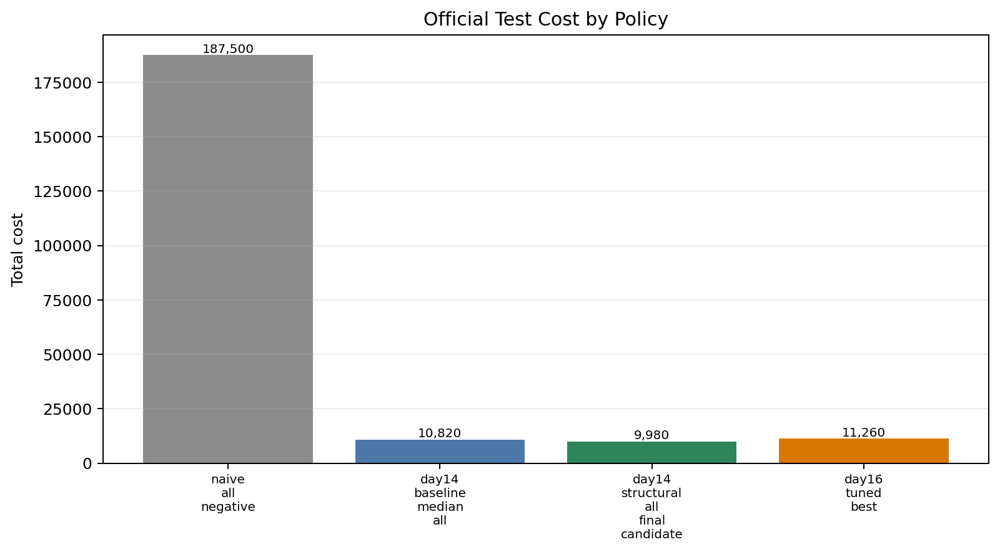
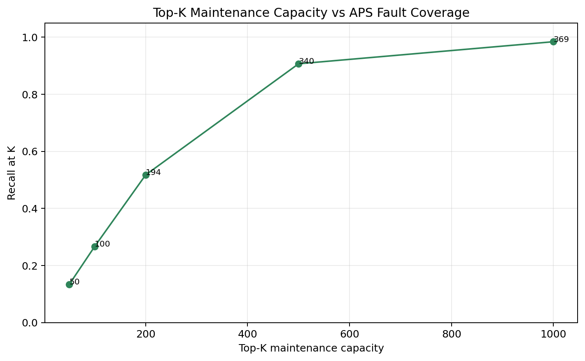
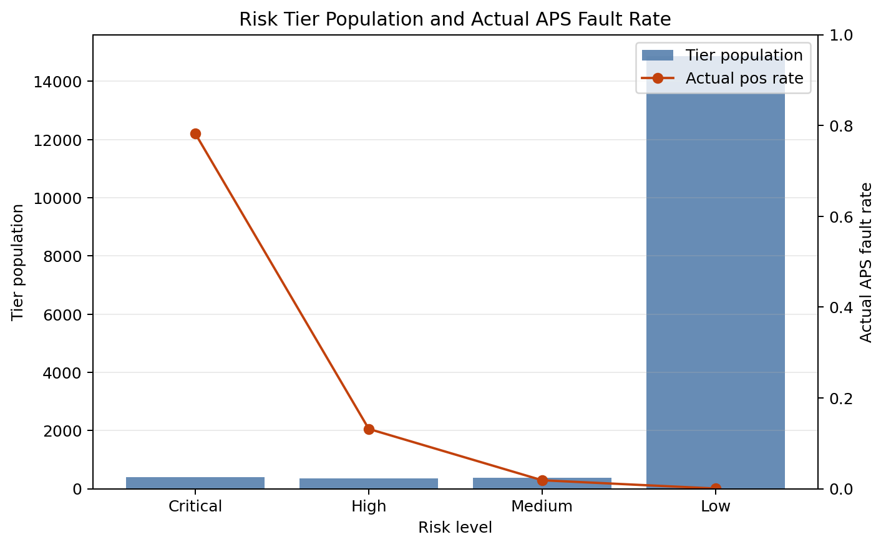
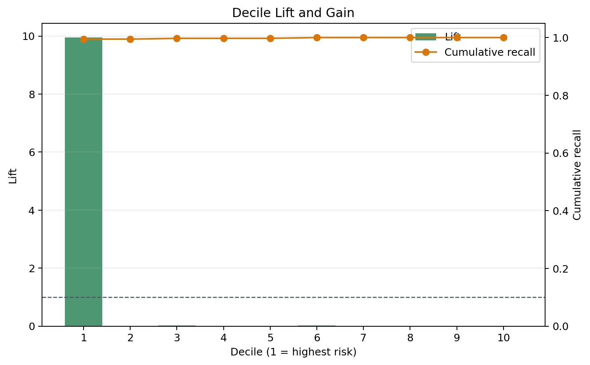
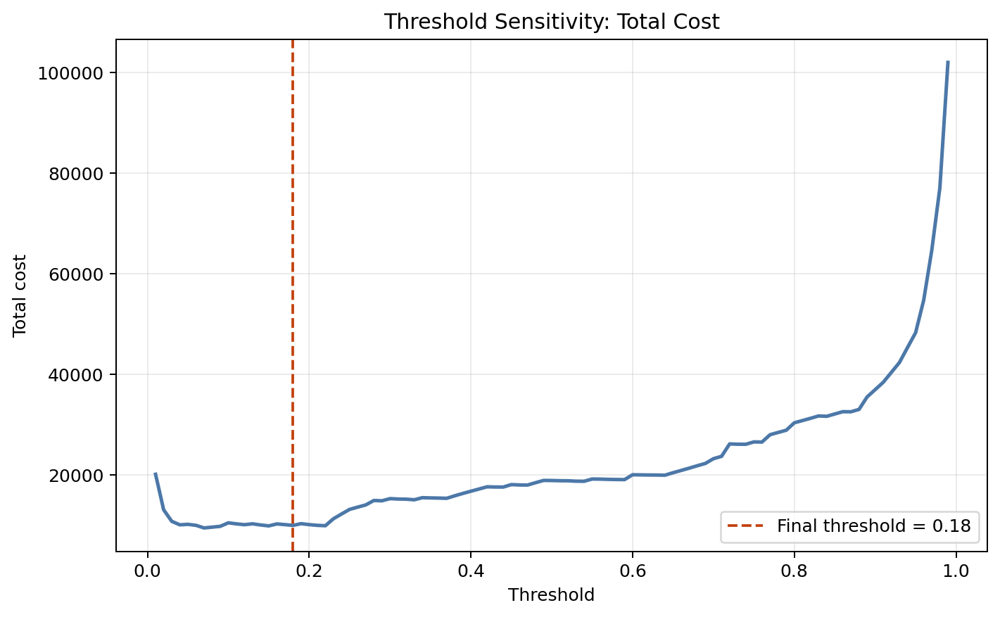
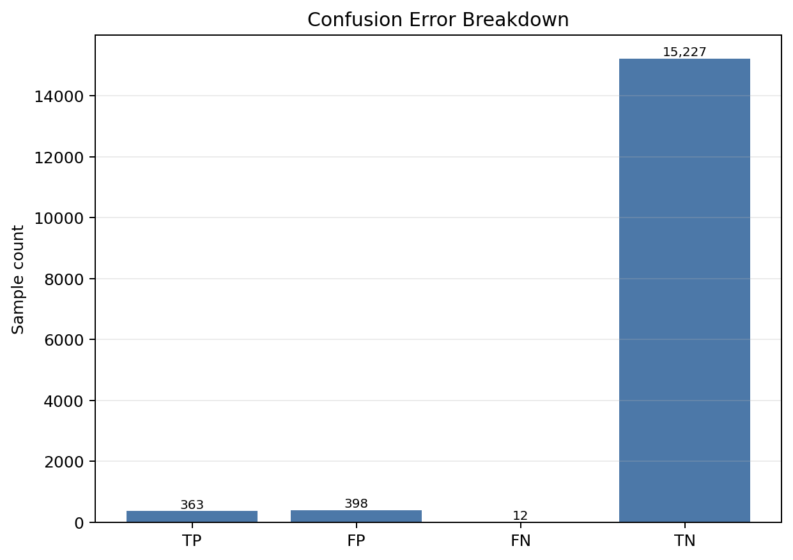

# SQL Business Insights for Scania APS Predictive Maintenance

本报告由 `scripts/18_generate_business_insight_figures.py` 基于 Day19 `outputs/sql_exports/` CSV 生成。本轮不连接 MySQL、不重新训练模型、不重新选择阈值，也不修改 `data/raw/`。

## 1. 当前最终候选方案

当前最终候选使用模型 `xgboost_scale_pos_weight` 与策略 `median_all_structural_all`，阈值来源为 `day13_valid_best_summary`，threshold=0.18，并只在 official test 上做最终观察。

- model_version: `day14_structural_all_final_candidate`
- threshold: 0.18
- TP / FP / TN / FN: 363 / 398 / 15227 / 12
- total_cost: 9980

不采用 Day16 tuned 或 Day18 ensemble 作为最终主结果：Day16 tuned 在 valid 上改善但 official test 没有泛化，Day18 ensemble 未满足进入 official test 的 OOF 筛选条件。Day6 的 8640 是 test 回溯观察，不作为严谨最终结果。

## 2. Top-K 维修容量分析

如果维修团队只能检查风险分数最高的 Top-K 匿名样本，覆盖真实 APS 故障的结果如下：

- Top 50: hit 50 positives, recall@K = 13.33%, precision@K = 100.00%.
- Top 100: hit 100 positives, recall@K = 26.67%, precision@K = 100.00%.
- Top 200: hit 194 positives, recall@K = 51.73%, precision@K = 97.00%.
- Top 500: hit 340 positives, recall@K = 90.67%, precision@K = 68.00%.
- Top 1000: hit 369 positives, recall@K = 98.40%, precision@K = 36.90%.

这说明模型排序有维修排队价值：即使不直接讨论某个固定 threshold，最高风险队列也显著富集真实故障样本。

## 3. 风险层级人口与业务队列

- Critical: tier_population=404, 316 positives, actual_pos_rate = 78.22%, APS inspection queue=404, recheck queue=0, suggested_action = `immediate_aps_inspection`.
- High: tier_population=357, 47 positives, actual_pos_rate = 13.17%, APS inspection queue=357, recheck queue=0, suggested_action = `priority_aps_inspection`.
- Medium: tier_population=378, 7 positives, actual_pos_rate = 1.85%, APS inspection queue=0, recheck queue=378, suggested_action = `aps_recheck_or_additional_diagnosis`.
- Low: tier_population=14861, 5 positives, actual_pos_rate = 0.03%, APS inspection queue=0, recheck queue=0, suggested_action = `continue_non_aps_diagnosis`.

Critical / High 是最适合优先检修的层级，但 High 中仍包含较多 FP，意味着高风险队列会带来额外检查工作量。`sample_id` 仅表示匿名样本编号，不是真实车辆 ID。

## 4. 成本策略对比

- naive_all_negative total_cost = 187500.
- day14_baseline_median_all total_cost = 10820.
- day14_structural_all_final_candidate total_cost = 9980.
- day16_tuned_best total_cost = 11260.
- final candidate 相对 naive baseline 成本下降 177520，下降率 94.68%.
- final candidate 相对 Day14 baseline 降低 840 成本。

Day18 OOF policy 在 CSV 中保留为 `oof_train`，只用于内部稳定性观察，不能与 official test policy 直接横向排名。

## 5. Decile / Lift / Gain 分析

- decile=1 pos_rate = 23.31%.
- overall_pos_rate = 2.34%.
- decile=1 lift = 9.95.
- cumulative_recall@decile1 = 99.47%.
- cumulative_recall@decile2 = 99.47%.
- cumulative_recall@decile3 = 99.73%.

最高风险分位明显集中真实 APS 故障，支持“先检修高风险样本”的维修排序逻辑。

## 6. 阈值敏感性分析

- final threshold=0.18: threshold=0.18, workload=761 (4.76%), FP=398, FN=12, recall=96.80%, total_cost=9980.
- min cost threshold: threshold=0.07, workload=1016 (6.35%), FP=647, FN=6, recall=98.40%, total_cost=9470.
- min cost with recall >= 0.96: threshold=0.07, workload=1016 (6.35%), FP=647, FN=6, recall=98.40%, total_cost=9470.
- min cost with recall >= 0.97: threshold=0.07, workload=1016 (6.35%), FP=647, FN=6, recall=98.40%, total_cost=9470.
- min cost with FN <= 15: threshold=0.07, workload=1016 (6.35%), FP=647, FN=6, recall=98.40%, total_cost=9470.
- min cost with FN <= 12: threshold=0.07, workload=1016 (6.35%), FP=647, FN=6, recall=98.40%, total_cost=9470.

这些结果只用于策略敏感性展示，不能用来反向修改最终 threshold；最终推荐阈值仍保留发布政策中的 0.18。

## 7. FP / FN 错误分析

- TP=363, FP=398, TN=15227, FN=12.
- FN by risk_level: Medium: 7, Low: 5.
- FP by risk_level: Critical: 88, High: 310.

FN 是 APS 项目中最关键的业务风险；后续 Day21 的模型解释性 / SHAP 分析可以优先聚焦 FN 和高置信 FP 样本，但不能虚构匿名字段的真实物理含义。

## 8. 面试可讲的 3-5 个结论

- 业务成本角度：final candidate 将 naive baseline 的漏报成本主导问题大幅压低，official test total_cost 为 9980。
- 维修容量角度：Top-K 队列可以把有限检修资源集中到高风险匿名样本上，而不是平均分配。
- 风险分层角度：Critical / High 进入 APS 检查队列，Medium 进入复核队列，Low 继续非 APS 故障诊断。
- 模型排序角度：decile=1 的 lift 显著高于 1，说明风险分数排序对真实 APS 故障有富集能力。
- 阈值策略角度：阈值变化会同时改变工作量、FN 和成本；敏感性分析用于解释策略，不用于反向选择最终阈值。
